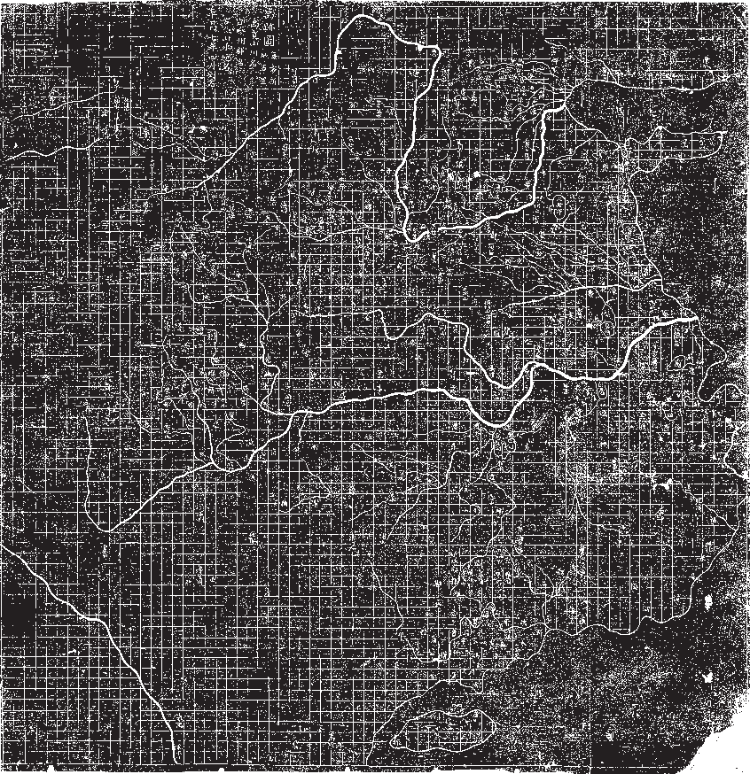

\linespread{1.15}
\pagestyle{empty}

1. \textit{It is not certain that all of the pig carcasses in the Huangpu River came from Jiaxing.}
2. \textit{There was no evidence of an epidemic among animals in Jiaxing.}
3. \textit{Water quality indicators in Jiaxing's water treatment facilities and at flows entering and exiting wetland areas remained normal. The water quality at the boundary between Zhejiang, Jiangsu and Shanghai was stable.}
\begin{flushright} -- Zhao Shumei, 2013 \end{flushright}

In March 2013, pig carcasses began to be discovered floating in the Huangpu, the smaller of the two rivers that proceed through Shanghai.

By the 21st, 10,570 carcasses had been pulled from the river, with a further 5,525 pigs discovered in upstream tributaries around Jiaxing.

As for where the pigs came from, what happened to them, and who was responsible, no clear statement was issued.

\newpage

\newpage

== SPATIAL FIX I == 

As you travel into the mouth of the Yangtze, following the southermost fluke of its delta, passing the lines of enormous container ships and barges, you enter the mouth of the Huangpu.

Passing by the skyscrapers, the nests of cranes, the well-kept wetland parks, the gigantic bridges, the ornamental gardens, the river begins to branch out almost before it has began, splitting into tributaries and canals, storm drains and wharfs, paved-over or redirected in a thousand places over thousands of years, drained and flooded, flowing and stagnant.

The size of the Yangtze, the 'long river', the scale of the canals and lakes and tributaries, their age and their cultural weight, all make the gigantic productions of Shanghai's monumental architecture seem isolated, still massive, but constrained.

The entire progress of China's modernization is played in reverse. First, you have the triumphant wealth of Chinese capital, an international city, a beating heart of global trade.

Then, where old Danwei complexes once stood, the places where the Maoists tried to erase the distinction between country and city, great factories and housing complexes, now converted or demolished.

Then, the docks and wharfs, the places where troops and planes bombed and burned the city, where the 19th Route army fought the Japanese, in the first stages of the Sino-Japanese war.

Then, the high watermark of the Taiping, who extended up the Yangtze to Shanghai; who then fell back, perhaps expecting support from their fellow Christians in the western concessions, who had, after all, just burned the Summer Palace to the ground.

None of these things are visible today, except as absences, curated exhibits in museums, blocky socialist-realist sculptures - the house of Sun Yat-sen, the tomb of Lu Xun, the house of Zhou Enlai.

\newpage

== SPATIAL FIX II ==

*Xinfeng Town ... changed from a "land of fish and rice" to a "water town of pigs"*
\begin{flushright}	-- xxcb . cn \end{flushright}

Already in Shanghai, the Huangpu branches and splits, expands, forms small lakes and sharp turns, a surface area that is both massive and enormously crowded, crowded in time as well as space, so one part of the government report becomes more clear:

*It is not certain that all of the pig carcasses in the Huangpu River came from Jiaxing.*

It could never be certain, either temporally, or spatially. There are just too many tributaries, too much history, too many moving parts and too many possible endpoints. The canal system never stops: you can follow a canal into a marsh, or a lake, into a suburb, or under a polythene factory, into a house, into a pipe, into the Grand Canal itself, south to Hangzhou, north to Beijing, into Hunan province, into the deep interior.

In the rubbing of the Yu Ji Tu map, the rivers are detailed with painstaking accuracy, but the regions beyond their banks, the great expanse of gridded space, are hardly marked.

\newpage

== SPATIAL FIX III ==

*One of the basic goals of Maoism was to break down the social division of labour, especially that between city and country. ... after the 1949 revolution factories were more widely dispersed across the countryside than before, and the growth of cities was curtailed. Within the Maoist city, the economic and social landscape was carved into repetitive, cellular units made up of danwei compounds. [35] Since 1980, by contrast, Chinese cities have grown like mushrooms, urban industry has burgeoned, and the internal landscape has been dramatically reconfigured.*
\begin{flushright} -- NLR 2007 Richard Walker \& Daniel Buck  \end{flushright}

As you travel inland, whichever tributary you choose, there is one constant. The size, the sharpness of the blocks, the spans of steel and concrete, the stretch of each street from one side to the other: these things decrease. There is a shrinking, a hobbling, a crookedness that creeps in, a patched quality that is both physical and social.

Central Shanghai could be anywhere: it is, in a sense, everywhere.  The styles, the techniques, the mode of governance, all are global things, right down to the blind rivets holding the pressed-stainless seat to chairs you could discover in your house.

If you imagine the techniques, the forms, the standards, the emotional and social dispositions of global capitalism as a great shroud, bumped in places where cities press against it in one direction or another, then imagine the fanlike folds that extend out from each bump, you can imagine how uniformity extends out from Shanghai into Zheijang. Of course, everybody uses the same diameter rivets, and the same machine screws, but between these ridges, there are folds where heterogeneity survives.

In Zheijang, you cannot map the timeline across space. Sometimes, Shanghai is the future, and sometimes it is the past. The break-up of the communes, and the explosion of private or semi-private enterprise, market capitalism, was first trialed in rural areas, then brought to the cities.

In the revolution, communism happened in the countryside, then occupied the cities as an afterthought. 
\newpage 

== SPATIAL FIX IV ==

*The reporter asked Xu Wei whether it was better to fish for pigs or fish. He said, "It's better to make money."* 
\begin{flushright} --xxcb . cn \end{flushright}

A pig fishing team typically consists of three groups of five people, two small boats, and one large one. One person drives the boat, and the other four hook the pigs. The small boats work with the big boat: the pig-fishing team in the small boats first hook the dead pigs from the weeds into the middle of the river, then the team on the larger boat hoist the pigs aboard.

Fishermen who fish for pigs can earn 150 yuan a day, and often fish for white waste (plastic, paper, etc) for an additional 70 yuan per day, whenever the flow of pigs is sparse. 

These sums are paid by the local government, which funds pig- and-white-waste fishing fleets in several of the villages along the tributaries of the Huangpu.

The fleets work all year round.

These operations maintain the visual appearance of the river as it crosses into Shanghai. 

\newpage

\newpage
== SPATIAL FIX V ==

*‘I have seen the world spirit’, not on horseback, but on wings and without a head* 
\begin{flushright} --(Adorno, MM, 2005 tr. Dennis Redmond) \end{flushright}

At the heart of Jiaxing itself, there is South Lake, where the chinese communist party was founded, not at any specific place, but on a tourist boat, which they had hired to escape harassment from the French Concession police.

Now, there is a museum, a small red-brick house, with a wax diorama of the attendees of the first Congress, a table headed by Mao, even if, at this time, Mao would have been a teacher at a primary school in Changsha, and no real leader of anything.

Most of the other figures attending died in the ensuring years, invariably violently, either in direct conflict or through execution, by the Guangxi Clique, Chiang Kai-shek, or the Japanese.

Traveling outward, you can see another sort of world spirit, the infinite rows of concrete-steel skyscrapers you can see anywhere, marching straight out of a Le Courbusier drawing, and into the future, forever, but they are right next door to the kind of residential blocks that have washing hanging from poles and wires strung between buildings, a set of baby clothes on one pole, a nice shirt and trousers on another.

Further out, these places predominate, and you see flats with stained yellow concrete render, half the windows caged in boxes of mild steel bars that jut out between air-conditioning units.  There are grey galvanized sheets of corrugated roofing, a baby-pink moped, some grand old concrete benches, one of them cracked on one leg, a lot of cables crammed into some PVC piping going up the side of the building, a steel door flanked on either side by signs that say 'no parking', a few old pots that look like they might have contained flowers.

Then, as you get into the outskirts, you start to see the endless half-pipes of pig sties, so many of them they look like giant steel furrows in a field.

\newpage

== SYNCHRONIZATION I ==

*The abolition of the communes and instigation of the household responsibility system allowed some farmers to prosper in the richest zones, but it has left marginal producers increasingly exposed to low prices, poor soils, small plots, lack of inputs, and the corruption of predatory local cadres.* 
\begin{flushright} --(R Walker \& D Buck, 2007) \end{flushright}

Zheijang province, then, was a good place to be a farmer. In 1980, Shanghai housed six million people. By 2013, it had grown to 22 million. 

The population of pigs, the weight of carcasses consumed, expanded to the same degree, rising sharply year by year, resulting in a 2011 figure of seven million pigs. Two Berlin worth of swine, crammed into thousands upon thousands of small family farms, each butting the edge of a canal or river, so the river ran so thick with the waste that it became black and lifeless.

Every year, 2 - 4 % of these pigs would die of illness, creating up to 300,000 carcasses, most of which would be sold in the black market.

The year before, an illegal slaughtering operation that processed tens of thousands of such pigs a year was shut down. 

Three butchers were sentenced to life in prison.

\newpage

== SYNCHRONIZATION II ==

*And that is the line which the learned call the diagonal. And if this is the proper name, then you, Meno's slave, are prepared to affirm that the double space is the square of the diagonal?*
\begin{flushright} -- Meno (Jowett) \end{flushright}

In this, there is a pre-established synchronization, a fact which is not communicated, but is rather present both to the slave, and to Socrates, prior to communication.

Then, there are forms of synchronization, like the 50hz wavelength that is emitted from almost every plug socket in the world, which are explicit, and painstakingly maintained. 

The breakup of the commune system and the reorganization of farmers along market lines was a sort of synchronization: the metropole has far more control and better visibility over commodity prices than it has over discussions in remote communes, or actions of distant party cadres.

The other side of the retail-farmer coin is the unsuccessful farmer, suddenly exposed and vulnerable, who is forced to leave their community in search of work. 

This too increases the power of the metropole. Separated from all social and familial ties, the ex-farmer confronts state power as an individual, absolutely unsupported in both moral and material terms.

They become the rootless workforce, both the raw labour, and the gaseous, ever-present labour oversupply, the mass of the unemployed and underemployed that have become the dominant means of disciplining the workforce. 

\newpage

== SYNCHRONIZATION III ==

*Yeah, well, that’s a funny story. That’s what I said and what I believed, and yet...  Who was it?  Somebody sort of proved that I was wrong about it, that I hadn’t got it from Noam Chomsky, because the dates were all wrong somehow.  But--  God, who was that?*
\begin{flushright} -- Backus, discussing the influences of Backus-Naur form \end{flushright}

The danger of synchronization should be obvious at this point: if everybody is on the same page, at the same time, and the pages are being written by forces at least partially, perhaps entirely out of control, violent surprises will happen.

The system at this point is like a group of massive industrial motors, all moving perfectly in sync with the mains, each with a tiny, imperceptible wobble, that sums to create a thunderous vibration, a shuddering noise that reaches down and begins to crack the concrete below.

State surveillance, so good at infiltrating *organizations*, is powerless against the implicit organization of the state itself: there is no way to prevent every pig farmer in Jiaxing region from waking up one day, and deciding to drown their pigs in the canal.

\newpage

== MASS INCIDENTS I ==

*includes provocation or troublemaking, gambling, running underworld criminal organisations, obstruction of official business, mob fighting, delaying the delivery of mail, holding mass orgies, computer hacking, making and selling fake police uniforms, forging identity cards, burning national flags and corpse desecration.* 
\begin{flushright} -- (2007, Absurdist Republic) \end{flushright}

In 2005, 87,000 'mass incidents' were recorded across China. The dumping of pigs, however, was not a mass incident in the official definition. There was no coordination, no political message, no grievance. There was simply more pigs than could be sold through the usual black-market channels, more pigs than could be managed by the usual 'pig-fishing' fleets, and more pigs than could be hidden in the vast web of waterways that flow into Shanghai.

If you define an event as something out of the ordinary, a significant moment, an abstract point where two parts of the same teleology are articulated, this was not an event. Nothing happened. The river simply flowed on, as it always had, and the pigs died, as they always had, and they were dumped, the only way they could be.

The event, such at it was, was just the breakdown of the membrane between one region and another - the region where capitalism involves people wearing suits in skyscraper offices, and the region where capitalism involves people throwing corpses into a foul and open sewer, a disturbing and awful moment of transparency between the metropole and the periphery, without any obvious way to cover up after the fact.

\newpage

== MASS INCIDENTS II ==

*crossing the river by feeling the stones*
\begin{flushright} -- slogan, Chen Yun, later associated with Deng Xioping \end{flushright}

One can draw a line from Pyotr Stolypin, to the USSR, to imperial japan, to post-war japan, then from both directions at once back to China - a line that charts an administrative tradition that aimed for a single goal: modernization without revolution.

This is an awkward genealogy, from anti-communist, to communist, to anti-communist, to pacifist, to communist -- all, however, deeply invested in their respective modernization projects; just as awkward, China's relationship with the USSR, at times so bad that it escalated to tank incursions and artillery bombardment, just as awkward, China's relationship with Japan, which provided much of the investment and expertise that sits at the foundation of the Chinese economy.

The list provided should give an idea of the scale of the problem: three of the states on this list no longer exist. Pyotr Stolypin not only failed to prevent the revolution, but was blown up by a bomb planted by an anarchist who was, among other things, a police spy.

Deng Xiaoping's 'cat theory': "It doesn't matter whether a cat is black or white, as long as it catches mice," does not mention that these cats have a disturbing tendency to develop scales, additional eyeballs, gills, the river that one is crossing, by feeling the stones, is also full of broken bottles, voids, violent currents.

The one thing that all these nations share is an acute and sustained threat from the West, both culturally and militarily, a constant goad that necessitates 'uneven and combined development', the simultaneous adoption of some of the most advanced forms of capitalism, and the presence of non-capitalist economic modes, ideas, populations.

In all of these contexts, the consequences of 'not catching mice', not crossing the metaphorical river, are very clear. Even being too slow to modernize, in the case of Qing China, can result in dismemberment.
\newpage
== SATSUMA I ==

| *The sparrow sings,*
| *The nightingale dances,*
| *And the green fields are lovely in the spring,*
| *The pomegranate flowers crimson,*
| *The willows are green-leaved,*
| *And there is a new picture.*
\begin{flushright} -- Mao Zedong, quoting a Japanese song called *The Battle on The Yellow Sea*, commemorating the japanese naval victory at Tsushima (Edgar Snow --). \end{flushright}

We can then trace back, from Mao the Chinese schoolchild singing Japanese songs, to the formative experiences of the Japanese admiral at Tsushima, Tōgō Heihachirō, then also a child, manning one of the shore batteries around Kagoshima, in Satsuma province.

This was three years after the British had burned the Summer Palace: a dispute over the death of a British merchant had led to the bombing and burning of Kagoshima by the Royal Navy, after which, the British demanded an indemnity of £25,000.

This was not unusual at the time. 

Both the reactions of the Satsuma daimyõ, and the reaction of Heihachirō, were unusual. The Satsuma daimyõ wrote to the British, in the immediate aftermath of the bombing, to buy some of the British warships. 

Seven years later, amid cordial relations between Satsuma and Britain, Heihachirõ would go and study in the British navy, eventually returning to japan on one of the British-built ships that would form the kernel of the Meiji emperor's navy.
\newpage

\newpage

== SPATIAL FIX V, SYNCHRONIZATION IV ==

*you have seen those mining cables that are wound around a wheel, and that unwind in the search for blocks of stone or mountains of coal at a depth of twelve hundred feet.  The wheel moans upon its axle; the cable stretches tight with the weight of its enormous charge. We, too, are drawn taut like the cable; but we do not moan like the wheel,*
\begin{flushright} -- Michel Chevalier, "Religion Saint-Simonienne: Le Bourgeois, le reveateur" (WB, U6Al) \end{flushright}

Between the endless rows of pig farms, on the islands between the canals, under fiberglass roofing, under great chromed ducts, you can see the huge machines of Jiaxing: an oven forty meters long tempering a woven mesh of white plastic twine.  Each line runs from a spool that hangs on a massive rack, collecting in a great sunburst of translucent plastic. 

On either side, you can see all the things you always find in workshops, old bottles of fizzy drinks, yellow stained concertina piping, somebody's work glove. There are great tanks of coolant, cut-off strips of plastic line, an orange polythene bag, some spare spools from the racks in a little pile, a golden drink can, empty, and a royal purple towel.

There's the fuse box, no cover, circuit breakers disgorging a bunch of shiny black cable, big pumps with all the paint scraped off at the back, some bits of acrylic tubing that are full of yellow grease, strange, hairlike clots of plastic where the machine has got jammed and somebody has pulled the jam out.

There are big fluorescent lights, just the tubes hanging from their wires, with no lightshades or cages, the wires themselves protruding from brittle, finger-thick plastic piping.

There are handrails over the great rollers that press the plastic line together, so you can make sure there's nothing stuck in there without falling in, and on those rollers, somebody has tied rags of bright red polyester cloth, like carnations.
\newpage

\newpage
== BUBBLE ==

*the set of all points that are at a distance r from a given point in a three-dimensional euclidian space* 
\begin{flushright} -- paraphrased from Wolfram MathWorld \end{flushright}

If you think of a bubble as a stack of circles progressing through a material, with the circles at the top and the bottom being infinitely small, and the circle in the middle having the radius r, you can see that the bubble itself does not move. Rather, the host material parts, like a bead curtain that somebody is running their hand through, and since the motion of each point on the edge of each circle has an exact opposite, on the exact opposite side of the circle, the net lateral motion is always zero.

It is only when the bubble arrives at the surface, when it oblates, stretches, bursts - then the mass of the material moves *downward*, and the bubble itself dissipates in unpredictable directions.

== PLAGUE ==

*look at the feed that's dribbling out of this auger,*\begin{flushright} -- Tom Gillespie, 2020 \end{flushright}

In 2020, almost half the Chinese pig population died of African Swine Fever, a haemorrhagic fever that can be carried by ticks, through contaminated food, on surfaces, on the shoes of workers, on their cars, in the mouths of vermin, in the pork sold at market.

The disease kills nine out of ten infected, and even after killing all the pigs, after a deep cleaning and disinfection of the land itself, the site would remain infectious for months after.

The small backyard farms that dominated Jiaxing in 2013 would not have the resources to protect their herds from the disease, or the political connections to protect their farms from regulatory intervention.

With a 'normal' death rate of 2 - 4 %, that is, without any specific pandemic, the mass of pigs were perpetually sick, prone to all sorts of chronic and acute illnesses, dying from the cold, from the water, from the feed, plague was inevitable.
\newpage

== PLAGUE II ==

*'Zero tolerance' for littering of dead pigs*
\begin{flushright} --- China Broadcasting Network, Jiaxing, March 16 (Jiaxing station reporter Zheng Shengzhong) \end{flushright}

There was, however, no evidence of an epidemic amongst the pigs of Jiaxing. In the weeks following the arrival of the dead pigs in central Shanghai, there was a frenzy of official activity.

Jiaxing city demolished 15 million square meters of pig houses, and invested large sums to build centralized waste disposal plants. The 80,000 farmers displaced would go on to find other employment.
\newpage

== ENDLESS PORFIRIATO I ==

|	*Scorched by a tar-blind sun*
|	*In woods that stink of factories.*
\begin{flushright} (1869-71 *The Hands of Jeanne-Marie* Rimbaud, tr. Jeremy Harding, John Sturrock) \end{flushright}

The breakup of the commune system, the breakdown of township and village enterprises, the dismantling of the massive state-owned industries, the rolling collapse of retail farming, the enviromental collapse, the growth of a gigantic migrant worker population, cut out from overburdened state services by a Hukou system that, like a zombie, never seems to stay down for long - perpetual unemployment, displacement, underemploynment, overwork, temporary conditions and temporary contracts - this is all familiar.

The words, the specific institutions are different, but the dynamics are the same. The state, wishing to avoid more surprises, prefers centralized farms, a hundred thousand pigs packed in one house, just like how it works in the rest of the world.

Perhaps some of the retail farmers of Jiaxing now work in the great blocks of pig pens, where they live in dormitories, and go through decontamination procedures whenever they enter the site, stripping down, leaving their own clothes in a locker.

As soon as the farms were brought into the market, they were in effect already centralized. They all were reacting on the same conditions, moving in sync, absolutely fixated on the same page. The consolidation, the proletarianization, the replacement of many farmers with one, gigantic machine-farm, is a simplification. The state must only keep the phone numbers of a handful of people, now, to find out why the river is full of corpses.
\newpage

== PUPAE I ==

|	*But there's mildew and formic acid in the vats.*
|	*Add sulphur and tannic acid.*
|	*The smell from the ferment is not the rich odor of wine, but the smell of decay and chemicals.*
\begin{flushright} -- (Steinbeck 1939) \end{flushright}

In holometabolous insects, there are three distinct stages in their lifecycle: egg, larva, pupa, and imago.

The pupal stage may last for weeks, months, or even years, it can enter dormancy or diapause, waiting for the conditions where the imago, the adult form, can survive.

Inside the hard shell, many of the organs and structures of the larva are broken down, until the pupa contains an unordered mass of cells, within which the 'imaginal discs', the embryonic forms of the parts of the imago, are found.

These imaginal discs elongate and differentiate, forming new and different organs, some pupal cells migrating to take places in these new organizations, being carried along as the discs elongate, break, and articulate.

If this process is allowed to carry on unto completion, the imago will emerge, its metamorphosis complete.
