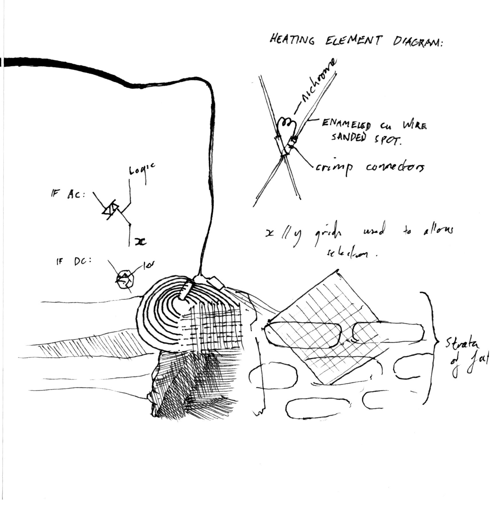
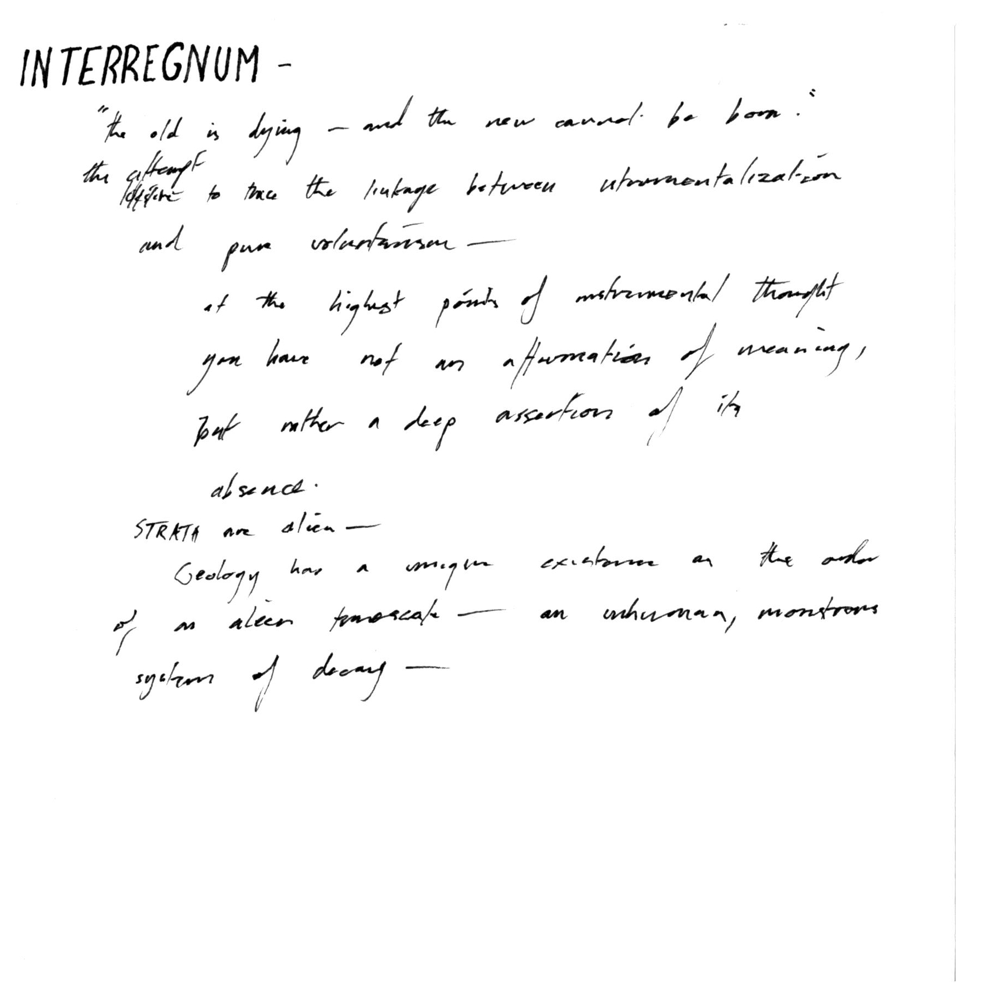
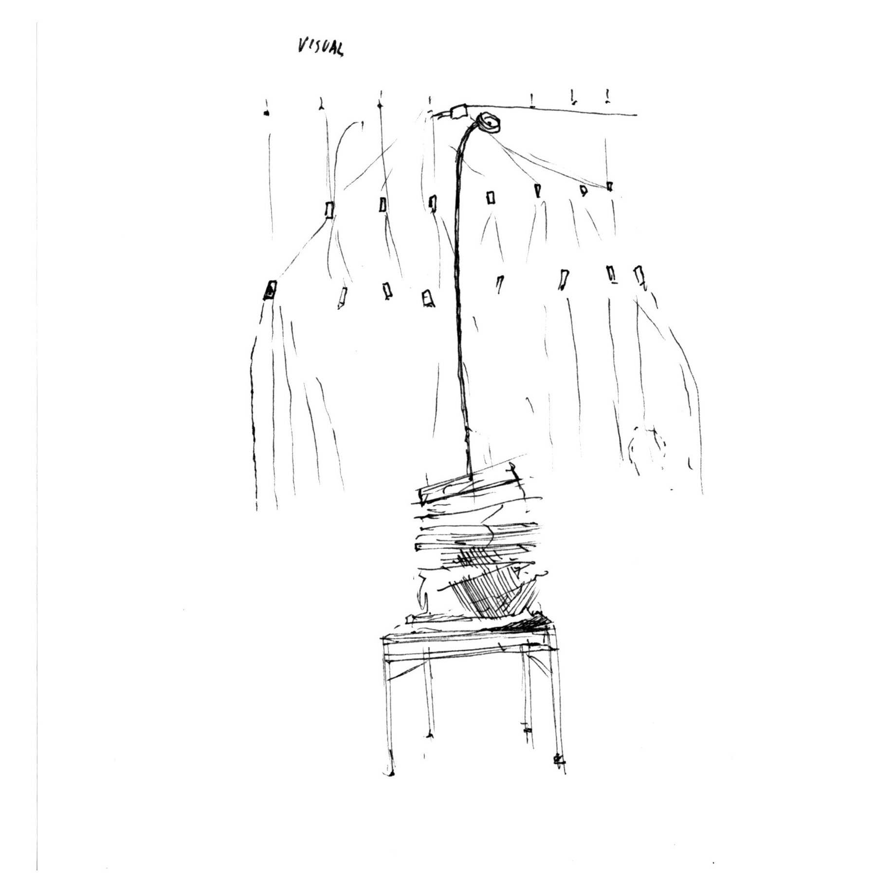

--------------------------------------- ----------------------------------------
{width=100%} {width=100%}
{width=100%} {width=100%}
--------------------------------------- ----------------------------------------
<!--more-->
Initial sketches of INTERREGNUM:

TECHNICAL:

The input side is essentially a large number of capacitive sensors, hanging from the ceiling. 
(possible technical issue: the range of capacitive sensors could be a problem)
For this, dedicated capacitive sensor modules would be used, while the sensor itself would be comprised of ordinary engine wire.

The program itself would collate the data from the input side, then use it to control the output through Serial.write (or something similar). A two-dimensional array would be used to map the inputs to the outputs.
The output itself would consist of NiChrome wire arranged in a two-dimensional array, so an input at sensor (x,y) would be stored as a value at [x][y], then output as a control signal at (x,y).

Triacs would have the advantage of simplifying the power supply, since I could use AC.

Mosfets would have the advantage of amplifying the input in an analog manner.

[[Possible danger of wax explosion?]]

THEORETICAL:
(very rough direction for reading)
STRATA:
Continuing the analysis of geology in the context of the Anthropocene // Thousand Plateaus, Empire, probably Bergson, probably Bachelard (for rupture). Again, Smithson.

WAX:
WBenjamin, in Arc Proj, if iirc. Also Deleuze, Opacity. Also, Italo Calvino Cosmicomix.

PUPAE:
Gramsci, also probably WBenjamin Theses on Phil of History.

ROUGH IDEA:
 - conceptualizing culture in the age of the internet as a sort of 'instrumentality gone mad', and trying to understand some of the aporias of this situation - where instrumentality turns into voluntarism, or vice versa. 

 ROUGH BACKDROP:

The neoliberal pattern was framed around the slogan that 'there is no alternative', and as such, politics became simply a matter of resigning people to the facts, even if those facts were, on closer inspection, a little doubtful. 

This framework led to a kind of political struggle that was as anemic as it was asinine, with the normal model comprising of two identical parties standing off across an isle, trading personal insults in the absence of real differences in program. 

In this ideology-free ideological context, the left project was, in broad terms, to make real politics possible again. In decades that combined media saturation with a complete media blackout about alternatives, a kind of radical epistemology became a cornerstone of leftwing thought.

I think it'd even be reasonable to say the main point of similarity of a plurality of influential thinkers in the neo-liberal era, is the presence in their corpus of obvious resources for critiquing the episteme that, in the neo-liberal era, was trapping us into a situation without alternatives. 

In the aftermath of the turbulence, torment and absurdity of 2016, it seems that this project has been turned against us. 

The other side demanded the impossible, one 'god emperor', with a mandate to build a wall visible from space, and they got it - and now, everybody is staring and watching with horror at the revival of real politics, which, as everybody used to know well, is shot through with the evil fantasies of a sick civilization.

