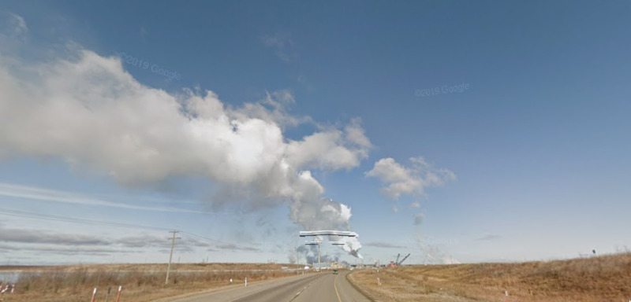
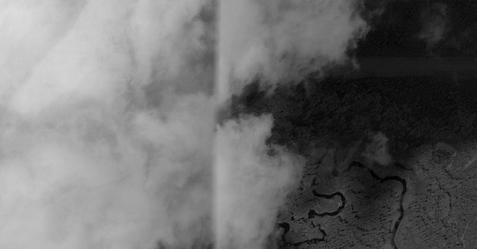
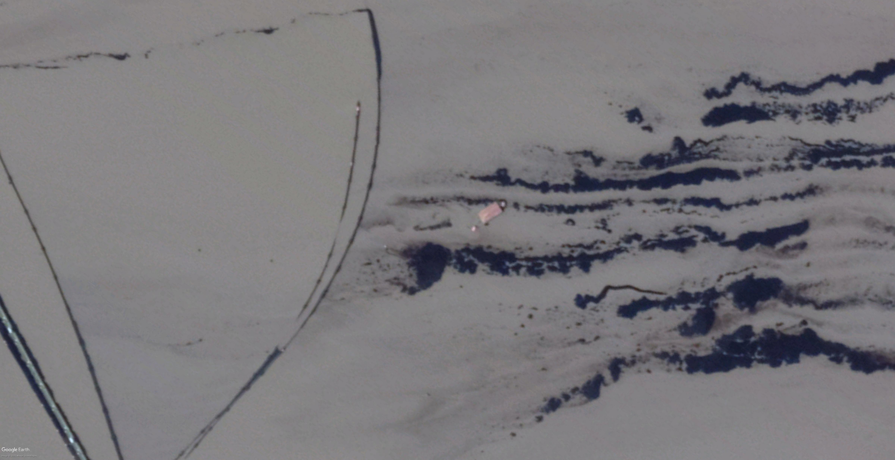
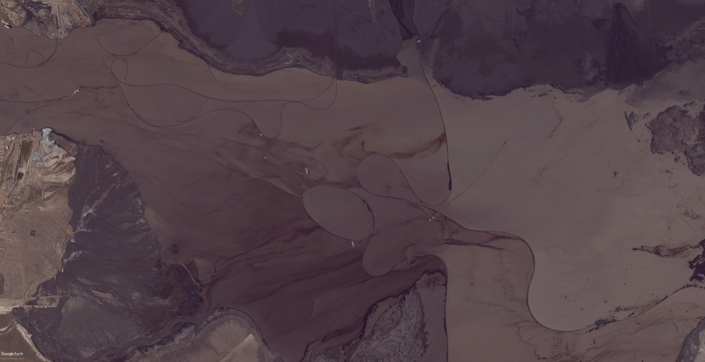
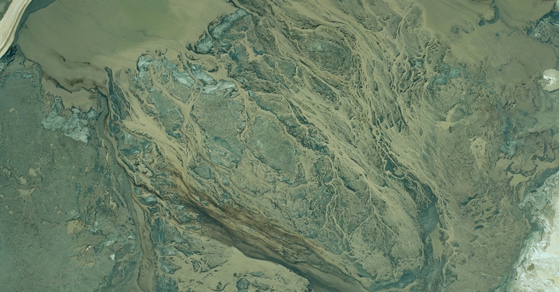
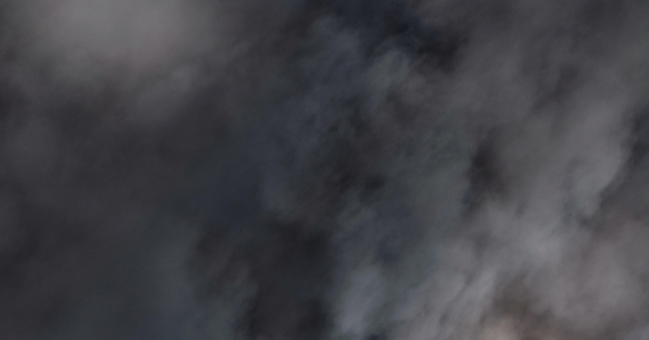
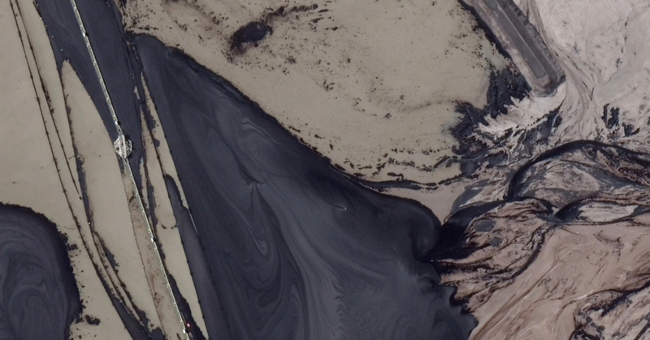
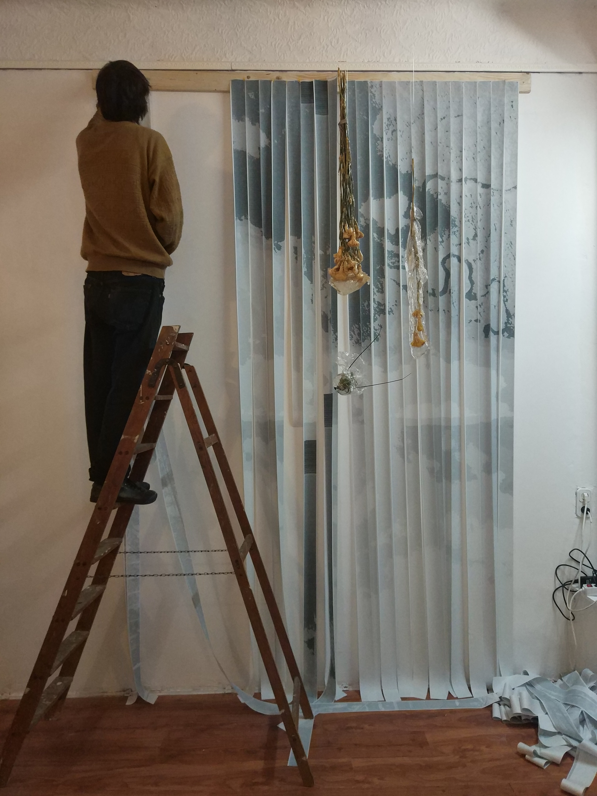

\
\

*"Alan Solomon had curated a whole painting show for the US Pavilion in Montreal. He basically asked all the artists for work that could be hung vertically, would hold up visually in a giant geodesic terrarium, and would pretty much only be seen from an escalator."*
		-- Greg Allen (2013) 

*"The family Gerridae [PONDSKATERS] is physically characterized by having hydrofuge hairpiles, retractable preapical claws, and elongated legs and body. ... [and] use the high surface tension of water to remain on its surface."*
  		-- en.wikipedia.org/Gerridae (2021)

*"To bring bitumen from Canada's Oil Sands to market requires transportation over sensitive boreal environments via rail, truck, and pipeline... The physical component of oil was observed to be the likely driver of pleuston [PONDSKATER] immobility and mortality."*
  		-- Tyler Andrew Black (2019)

*"The tip of the inverted obelisk touches the apex of the pyramid, 'just as' the finger of God touches that of Adam on the ceiling of the Sistine Chapel"*
  		-- Lyotard, tr. Bennington, Bowlby (1993)

<!--more-->










RECORDS OF A PONDSKATER


The thread here runs from Fan Kuan to Burke, then to Newmann - the background, the Northern Song, the French Revolution, the extraordinary dynamism of post-war America - is this phenomenal, terrifying weight of popular agency, the gigantic mountain of human aggregate, the twenty-seven-storey geodesic dome, the capacity of small-tolerance machined parts to build up into structures of demented scale.

The second point of interest is the appearance of scales invisible to the naked eye - things visible from a satellite, from the tip of a hydrofuge hairpile, some crushed glass or blood under a microscope, a gigantic network of canals and waterways fanning out from the Yangtse, and the attempt to engage with these scales, to feel empowered, or diminished, or to employ them as a tactic in a pre-existing conflict.

The images are from Google Earth, north of Athabasca, around the oil sand open-cast mines. It is noticeable that the mine itself, while very visible from space, is not visible from the roads that pass through it.

APPENDIX I: GENERATING FONTS IN ESCPOS FORMAT

The printer I had access to was very slow at printing bitmap images. To get around this limitation, I made a font which consisted of 81 unique combinations of 9 distinct dots. These can then be used to produce images by treating each character of the font as two pixels, and by converting a picture (in pgm format, and pre-cut for simplicity) into a stream of characters.

```c

#include <stdlib.h>
#include <stdint.h>
#include <stdio.h>

#define FONT_Y_BYTES 3
#define FONT_X 9
#define C1 33

typedef enum block_types {
	FULL,
	DOT9,
	DOT7,
	DOT7_H,
	DOT7_E,
	DOT3,
	DOT3_E,
	DOT1,
	EMPTY,
	TYPE_CNT,
} block_type;

//binary literals are a gcc extension
const uint8_t blocks[][FONT_X] = {
	[FULL] =	{0b11111111,
			 0b11111111,
			 0b11111111,
			 0b11111111,
			 0b11111111,
			 0b11111111,
			 0b11111111,
			 0b11111111,
			 0b11111111},

	[DOT9] =	{0b00000000,
			 0b00111110,
			 0b01111111,
			 0b01111111,
			 0b01111111,
			 0b01111111,
			 0b01111111,
			 0b00111110,
			 0b00000000},
                           
	[DOT7] =	{0b00000000,
			 0b00011100,
			 0b00111110,
			 0b01111111,
			 0b01111111,
			 0b01111111,
			 0b00111110,
			 0b00011100,
			 0b00000000},
                          
	[DOT7_H] =	{0b00000000,
			 0b00011100,
			 0b00101010,
			 0b01010101,
			 0b01101011,
			 0b01010101,
			 0b00101010,
			 0b00011100,
			 0b00000000},
                          
                         
	[DOT7_E] =	{0b00000000,
			 0b00011100,
			 0b00100010,
			 0b01000001,
			 0b01000001,
			 0b01000001,
			 0b00100010,
			 0b00011100,
			 0b00000000},
                          
                        
	[DOT3] =	{0b00000000,
			 0b00000000,
			 0b00000000,
			 0b00001000,
			 0b00011100,
			 0b00001000,
			 0b00000000,
			 0b00000000,
			 0b00000000},
                           
	[DOT3_E] =	{0b00000000,
			 0b00000000,
			 0b00000000,
			 0b00001000,
			 0b00010100,
			 0b00001000,
			 0b00000000,
			 0b00000000,
			 0b00000000},
                          
	[DOT1] =	{0b00000000,
			 0b00000000,
			 0b00000000,
			 0b00000000,
			 0b00001000,
			 0b00000000,
			 0b00000000,
			 0b00000000,
			 0b00000000},

	[EMPTY] =	{0},
};


//buf should be at no more than TYPE_CNT ^ 2 * FONT_X * GLYPH_Y_BYTES  in size
void combine_blocks(uint8_t * buf, block_type a, block_type b) {
	for (int i=0; i<FONT_X; i++) {
		buf[i*3]	= blocks[a][i];
		buf[i*3+1]	= blocks[b][i];
		buf[i*3+2]	= blocks[b][i];
	}
}

void define_escpos_font() {
	int glyph_count = TYPE_CNT * TYPE_CNT;
	int glyph_size = FONT_Y_BYTES * FONT_X + 1;
	int glyph_bytes = glyph_count * glyph_size;
	// + 1 for x dimension
	uint8_t * data = calloc(glyph_bytes, 1);

	for (int i=0; i < glyph_count; i++) {
		data[i*glyph_size] = FONT_X;
		combine_blocks( data + (i * glyph_size + 1), i/TYPE_CNT, i%TYPE_CNT);
	}


	char header[] = {
		0x1b,			//ESC
		'&',
		FONT_Y_BYTES,			
		C1,		//c1
		C1+glyph_count,	//c2
	};

	if ((fwrite(header, 1, 5, stdout)) != 5) 
		fprintf(stderr, "did not write all bytes of header");

	if ((fwrite(data, 1, glyph_bytes, stdout)) != glyph_bytes) 
		fprintf(stderr, "did not write all bytes of escpos");

	free(data);
}

void pgm_to_escpos_char_indices() {
	int w = 0;
	int h = 0;
	int max = 0;
	if (!scanf("P5\n%d %d\n%d\n", &w, &h, &max)) 
		fprintf(stderr, "pgm header malformed");

	int size = w*h;
	uint8_t * buf = calloc(size, 1); 
	uint8_t * out = calloc(size / 2, 1);

	if (fread(buf, 1, size, stdin) != size)
		perror("read less than expected");

	for (int i=0; i<(size / 2); i++) {
		int x = i % w;
		int y = i / w;
		int h_clamped = buf[y*2*w+x] * (TYPE_CNT-1) / max;
		int l_clamped = buf[((y*2+1)*w+x) % size] * (TYPE_CNT-1) / max;
		out[i] = h_clamped * TYPE_CNT + l_clamped + C1;
	}
	if (fwrite(out, 1, size / 2, stdout) != size / 2) 
		perror("bad write: ");

	free(buf);
	free(out);
}


int main(int argc, char ** argv) {
	char * usage = "d (no -) for defining the font\nc (no -) \
        for converting a pgm supplied on stdin\n";
	if (argc == 2) {
		switch (argv[1][0]) {
			case 'd': define_escpos_font(); break;
			case 'c': pgm_to_escpos_char_indices(); break;
			default: puts(usage); break;
		}
	} else {
		puts(usage);
	}
	return 0;
}

```


